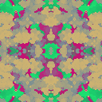

# golident

_golident_ generates dazzling, randomly-generated identicons with Conway's Game of Life visualizations.

     

---

**Table of Contents**

- [Installation](#installation)
- [Usage](#usage)
- [License](#license)

## Installation

```console
pip install golident
```

## Usage

```python
g = Golident('asdfqwer', size=128, iterations=320, num_colors=5)
g.show_identicon()
g.show_history()
g.save_identicon('asdfqwer_128.png', scale=2)
```


## License

`golident` is distributed under the terms of any of the following licenses:

- [Apache-2.0](https://spdx.org/licenses/Apache-2.0.html)
- [MIT](https://spdx.org/licenses/MIT.html)
